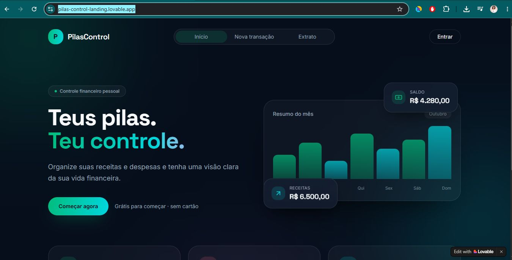
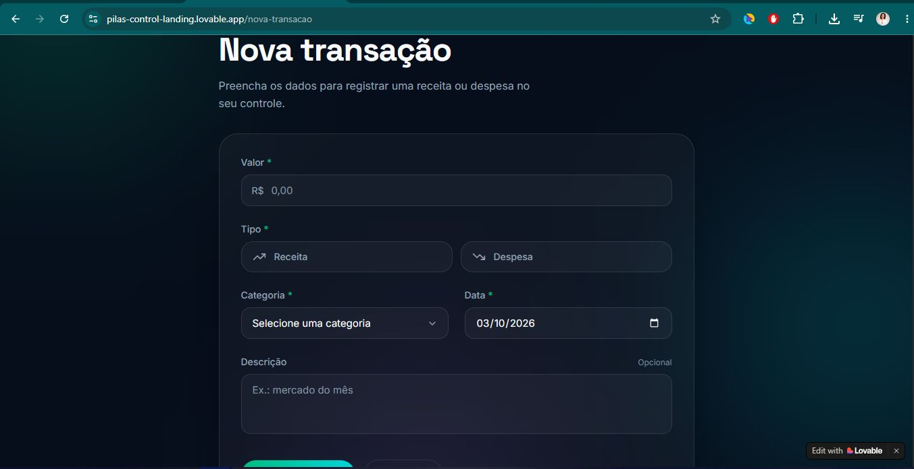
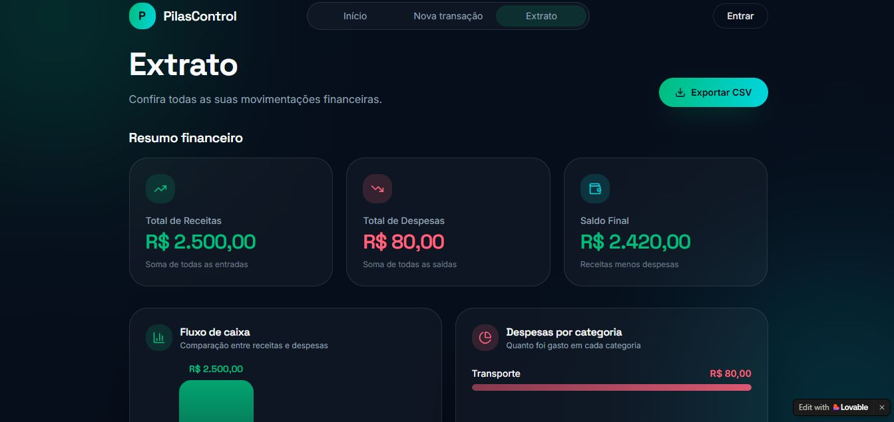
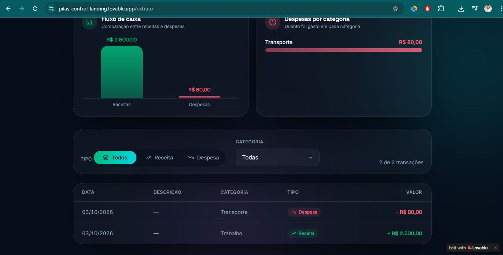

# 💰 PilasControl

> Teus pilas. Teu controle.

Aplicativo web de controle financeiro desenvolvido durante o desafio #7DaysOfCode, utilizando o Lovable e inteligência artificial para construção da aplicação.

## 🚀 Sobre o projeto

O PilasControl foi criado para facilitar o registro e acompanhamento de receitas e despesas de forma simples e visual.

O projeto foi desenvolvido ao longo de 7 dias, utilizando prompts para orientar a construção das funcionalidades e da interface.

## ✨ Funcionalidades

- Cadastro de receitas e despesas
- Categorias de transações
- Extrato financeiro
- Filtros por tipo e categoria
- Resumo financeiro automático
- Cálculo de receitas, despesas e saldo
- Gráfico de fluxo de caixa
- Gráfico de despesas por categoria
- Exportação do extrato em CSV
- Interface responsiva

## 🛠️ Tecnologias e ferramentas

- Lovable
- Inteligência Artificial
- React
- TypeScript
- Interface web responsiva
- CSV

## 🌐 Projeto publicado

[**Acessar o PilasControl**](https://pilas-control-landing.lovable.app/)

## 📸 Screenshots

### Tela inicial

### Nova transação

### Extrato

### Resumo e gráficos

## 📚 O que aprendi

Durante o desafio, pratiquei:

- Criação de interfaces utilizando prompts
- Estruturação de um aplicativo web
- Criação de formulários
- Validação de dados
- Exibição e filtragem de informações
- Cálculos automáticos
- Visualização de dados através de gráficos
- Exportação de dados para CSV
- Publicação de uma aplicação web

## ⚠️ Limitações atuais

Nesta primeira versão, as transações não possuem persistência permanente em banco de dados. Os dados utilizados durante a demonstração são temporários.

Uma próxima versão poderá utilizar um banco de dados e autenticação de usuários.

## 👩‍💻 Desenvolvido por

Fabiana Poetsch

Projeto desenvolvido como parte do #7DaysOfCode.
